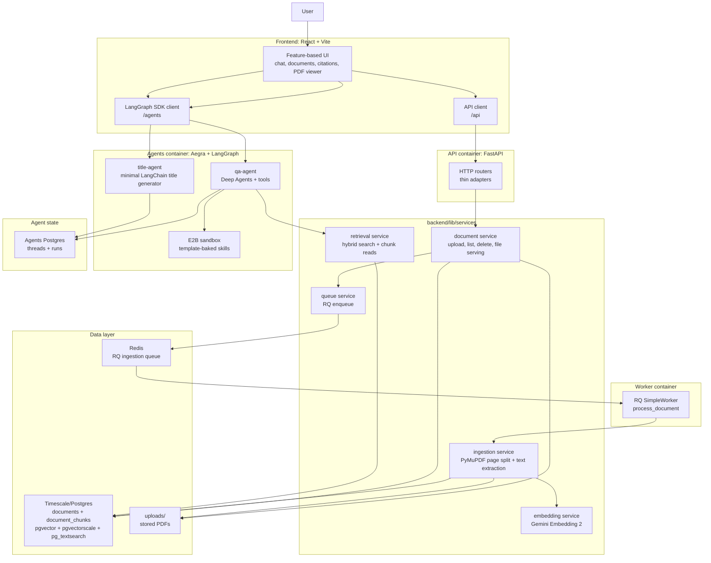
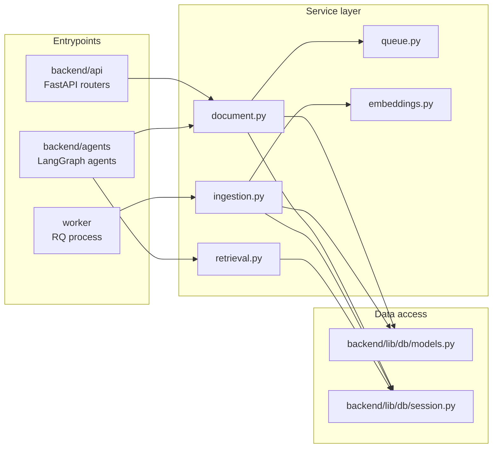
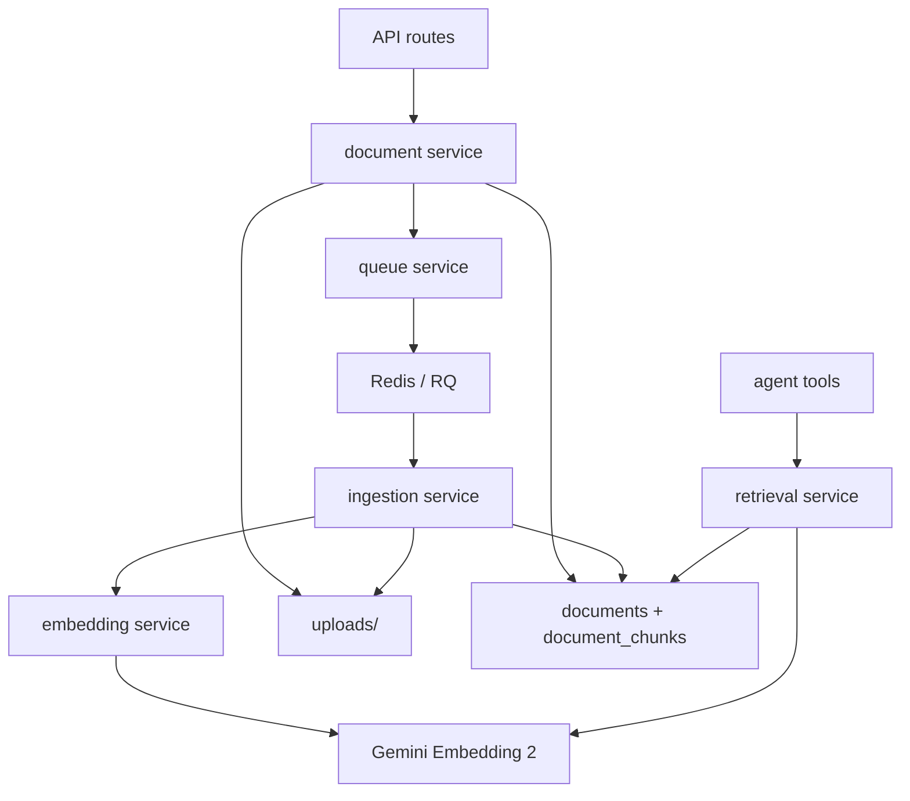
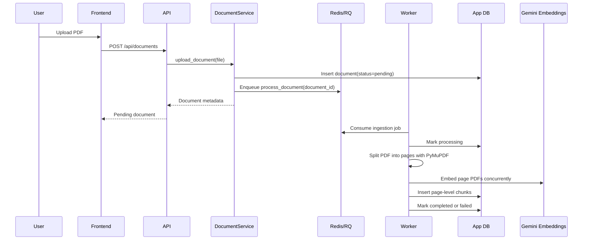
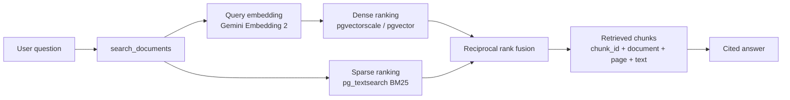
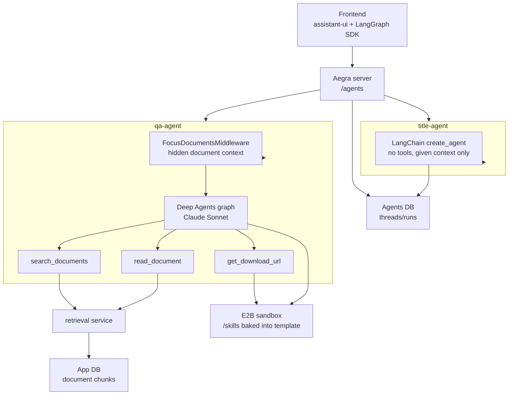
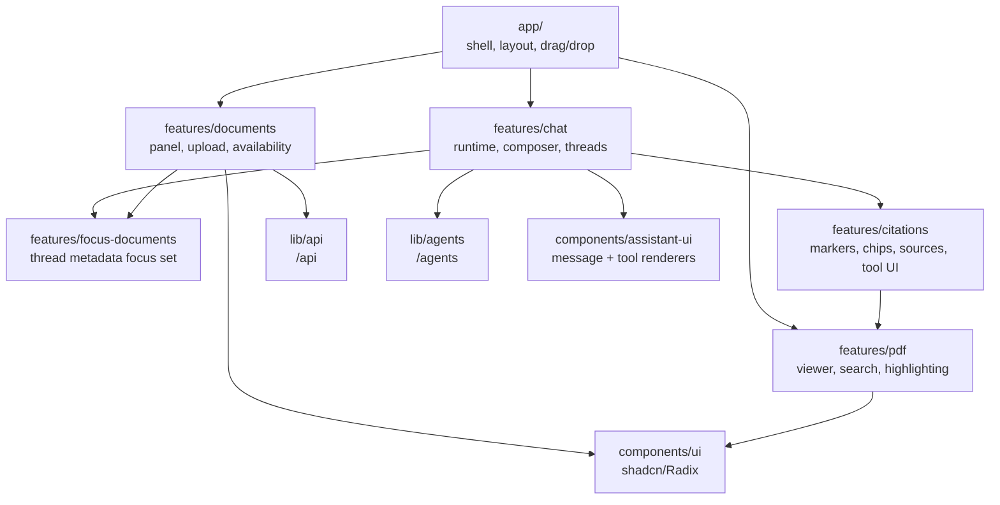
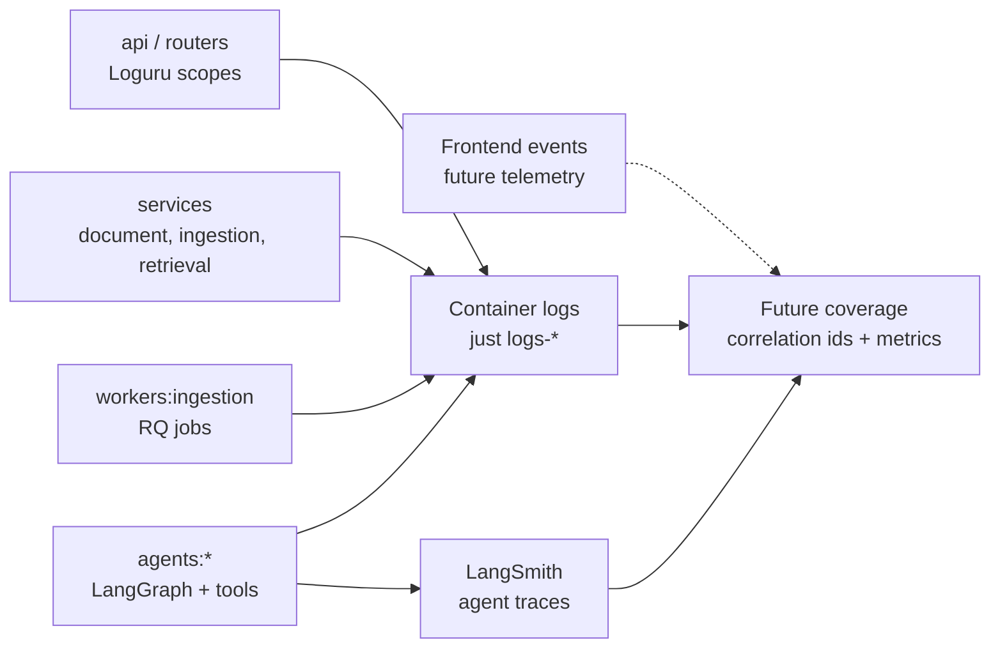
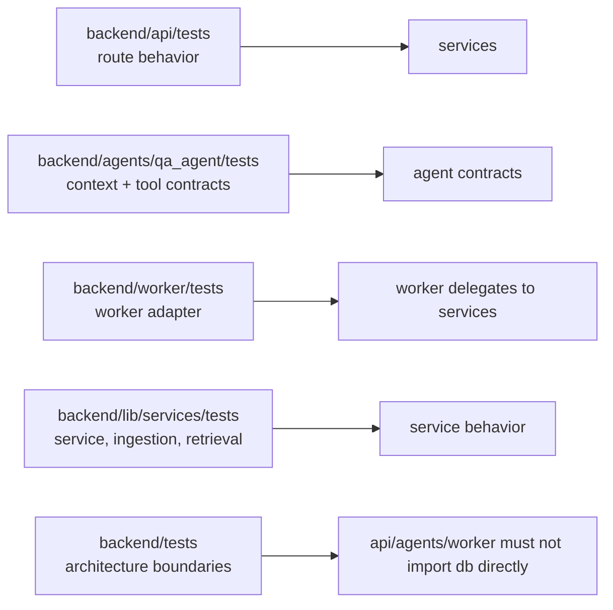

# Orbital Document Q&A

## Overview

Orbital is a document Q&A workspace for commercial real estate due diligence.
Lawyers can upload PDFs, pin important files to a chat, ask document-grounded
questions, inspect citations in the original PDF, and download generated files
from a sandboxed agent workflow.

The system is intentionally split into clear layers:

- **Frontend** owns the product experience and conversation state.
- **API** is a thin HTTP adapter.
- **Services** own application behavior, database access, ingestion, retrieval,
  and queue boundaries.
- **Agents** orchestrate LLM reasoning and tools, but go through services for
  document data.
- **DB** persists documents, page-level chunks, embeddings, and agent state.

That separation keeps the system lightweight where it should be lightweight,
while still giving the agent enough structure to cite, retrieve, and produce
files safely.

## Table of Contents

- [Overview](#overview)
- [Architecture](#architecture)
  - [Backend Monorepo](#backend-monorepo)
  - [Services](#services)
  - [Document Ingestion](#document-ingestion)
  - [Retrieval](#retrieval)
  - [Agents](#agents)
  - [Sandbox Skills](#sandbox-skills)
  - [Frontend Architecture](#frontend-architecture)
  - [Observability And Logging](#observability-and-logging)
  - [Tests](#tests)
- [Technology](#technology)
- [Development Setup](#development-setup)
  - [Prerequisites](#prerequisites)
  - [First Run](#first-run)
  - [Useful Commands](#useful-commands)
  - [Ports](#ports)
- [Sample Documents](#sample-documents)
- [Next Steps](#next-steps)

## Architecture



### Backend Monorepo

The backend is organized as a small monorepo:

```text
backend/
  api/                 FastAPI app and API Dockerfile
  agents/              Aegra-served LangGraph agents, skills, E2B template scripts
  worker/              RQ worker adapter and worker Dockerfile
  lib/
    db/                SQLAlchemy models and session factories
    services/          Shared application services
  tests/               Cross-module architecture tests
```

The dependency direction is deliberate:

```text
api      -> services -> db
agents   -> services -> db
worker   -> services -> db
```



`backend/api`, `backend/agents`, and `backend/worker` do not import the database layer directly.
The architecture test in `backend/tests/test_architecture.py` guards that rule.
This keeps request handling and agent orchestration thin, and leaves database
details behind service APIs.

### Services

The service layer is where application behavior lives:

- `document.py` stores PDFs, creates document records, enqueues ingestion,
  resolves files for viewing, and owns database session lifecycle for document
  operations.
- `queue.py` wraps the Redis/RQ ingestion queue.
- `ingestion.py` is the background job: split a PDF into pages, extract sorted
  page text with PyMuPDF, embed each single-page PDF, and write one chunk per
  page.
- `embeddings.py` wraps Gemini Embedding 2 for page-PDF and query embeddings.
- `retrieval.py` performs hybrid retrieval and document/chunk metadata reads for
  agents.



### Document Ingestion

Upload is intentionally cheap:

1. The API receives a PDF and calls the document service.
2. The service stores the file, writes a `documents` row with `pending` status,
   and enqueues an RQ job.
3. The worker marks the document `processing`, splits it page-by-page with
   PyMuPDF, extracts text, embeds each page with Gemini Embedding 2, and stores
   one `document_chunks` row per page.
4. Embedding runs in parallel with `EMBEDDING_CONCURRENCY=32` by default.
5. The document becomes `completed` or `failed`, with status visible in the UI.

The durable citation unit is a page-level chunk. Inline citation markers include
the chunk id plus an exact text span for PDF highlighting.

Page-level chunking is deliberate. Pages are natural, stable document
boundaries, which makes them easy to reason about in a legal review workflow and
gives citations a durable unit that maps cleanly back to the original PDF.
NVIDIA's chunking research found page-level chunking to be the strongest default
across diverse RAG datasets, with the highest average answer accuracy and the
lowest variance, and specifically notes that static page boundaries make
citations and references easier to preserve than token-sized chunks. See
[Finding the Best Chunking Strategy for Accurate AI Responses](https://developer.nvidia.com/blog/finding-the-best-chunking-strategy-for-accurate-ai-responses/).

The ingestion pipeline does not persist text bounding boxes yet. That was a
deliberate scope tradeoff to save indexing time and keep ingestion lightweight:
the system stores page-level chunks plus extracted text, then highlights the
exact cited text span in the PDF viewer on demand.



### Retrieval

Retrieval uses a hybrid search strategy over `document_chunks`:

- Dense retrieval: pgvector/pgvectorscale vector similarity over Gemini
  embeddings.
- Sparse retrieval: pg_textsearch BM25 over extracted page text.
- Fusion: reciprocal rank fusion combines the dense and sparse rankings.

The Postgres service uses `timescale/timescaledb-ha:pg17`, which bundles
pgvector, pgvectorscale, and pg_textsearch. Retrieval is exposed to the agent
through service-backed tools, so the agent never touches SQL directly.



### Agents

Agents are served by Aegra, which provides a LangGraph-compatible runtime:

- `qa-agent` uses Deep Agents with document tools:
  - `search_documents`
  - `read_document`
  - `get_download_url`
- `title-agent` is a minimal LangChain agent that generates concise chat titles
  from the user's first message.

The QA agent receives hidden focus-document context via middleware. Focus
documents are prioritized, but retrieval can still search the available document
library according to the chat's retrieval filter.

When a run has a thread id, the QA agent can attach an E2B sandbox backend. The
sandbox uses the `qa-agent-sandbox` template and exposes script-backed skills for
PDF, Word, PowerPoint, and spreadsheet work. Generated files are returned through
download URL tool artifacts, not raw URLs in assistant text.

### Sandbox Skills

The QA agent has two kinds of capabilities:

- ordinary tools, such as `search_documents`, `read_document`, and
  `get_download_url`, which are implemented in Python and exposed directly to the
  agent;
- sandbox skills, which are prompt-and-script bundles for document production or
  file analysis inside E2B.

Skills live in `backend/agents/qa_agent/skills`:

```text
backend/agents/qa_agent/skills/
  docx/
  pdf/
  pptx/
  xlsx/
```

Those folders are not copied into sandboxes at request time. Instead,
`backend/agents/scripts/e2b_template/template.py` bakes them into `/skills`
during the E2B template build. This keeps agent runs lightweight and
deterministic: every sandbox created from `qa-agent-sandbox` starts with the same
skill files and the same OS, Python, and Node dependencies.

The template installs the tools those skills need, including LibreOffice,
Poppler, QPDF, Pandoc, Tesseract, Node/npm, Python document libraries, and Node
packages for Office-generation workflows. The template also includes a smoke
check at `/usr/local/bin/qa-agent-sandbox-smoke` that verifies imports, command
line tools, Node packages, and `/skills/*/SKILL.md`.

To update or add a skill:

1. Add or edit the skill folder under `backend/agents/qa_agent/skills`.
2. Update `backend/agents/scripts/e2b_template/template.py` if the skill needs
   new OS, Python, or Node dependencies.
3. Rebuild the template:

   ```bash
   uv run python backend/agents/scripts/e2b_template/build.py
   ```

4. Create a sandbox from `qa-agent-sandbox` and run:

   ```bash
   qa-agent-sandbox-smoke
   ```

At runtime, the QA graph only enables sandbox-backed skills when a run has a
thread id. Runs without a thread id are created without an E2B backend and
without `/skills`, which keeps non-threaded graph loading simple and avoids
creating unnecessary sandboxes.

The skill folders are excluded from Ruff and Pyright because they are
agent-facing assets, not normal application modules. The application code around
them remains statically checked.



### Frontend Architecture

The frontend is a feature-based React application:

```text
frontend/src/
  app/                 App shell, layout, drag/drop orchestration
  components/
    ui/                shadcn/Radix primitives
    assistant-ui/      Assistant UI renderers and tool rows
  features/
    chat/              Assistant runtime, composer, threads, mentions
    citations/         Citation parsing, chips, sources, tool output
    documents/         Document panel, uploads, availability selection
    focus-documents/   Focus document state synced to thread metadata
    pdf/               PDF dialog, highlighting, preview/download support
  lib/                 API clients and shared helpers
```

The chat experience uses assistant-ui and the LangGraph SDK. The document panel
distinguishes:

- **Focus documents**: pinned to the chat and surfaced to the agent as hidden
  priority context.
- **Available documents**: retrieval scope for search; can be explicit document
  ids or `"all"`.

Inline citations are rendered as compact chips. Clicking a citation opens the
PDF dialog on the cited page and searches/highlights the cited text span.
Retrieved source files are rendered after the assistant response finishes
streaming.



### Observability And Logging

The backend uses Loguru through a small scoped logging adapter in
`backend/lib/logging.py`. Logs are structured around the system boundary that
emits them, so local debugging can follow a request or job through the stack
without guessing where a line came from.

Common scopes include:

- `api` for FastAPI lifespan and startup work.
- `routers:documents` for HTTP document endpoints.
- `services:documents`, `services:queue`, `services:ingestion`,
  `services:embeddings`, and `services:retrieval` for application behavior.
- `workers:ingestion` for the RQ job adapter.
- `agents:qa_agent` and `agents:title_agent` for agent graph/tool behavior.
- `db` for database session factory setup.
- `config` for settings initialization.

The log format includes timestamp, level, process, scope, message, and bound
context fields:

```text
2026-07-02 01:30:39.470 | INFO | MainProcess:90818 | services:ingestion | Ingestion completed | document_id='doc_123' page_count=12 duration_ms=8421.5
```

Use `LOG_LEVEL` to change verbosity locally. The `just logs-*` commands tail
the Docker services that emit these logs:

```bash
just logs-api
just logs-worker
just logs-agents
```

LangChain and LangGraph can also send agent traces directly to LangSmith, which
is the right place to inspect model/tool behavior, retrieval decisions, and
multi-step agent runs. The current codebase is ready for that style of tracing
through the standard LangSmith/LangChain configuration, but observability
coverage can still improve across the whole app: request correlation ids,
frontend interaction telemetry, queue latency metrics, ingestion timing
histograms, and explicit retrieval-quality traces would make production
debugging much sharper.



### Tests

Tests are colocated with the modules they cover:

```text
backend/api/tests/                 API route tests
backend/agents/qa_agent/tests/     Agent context/tool formatting tests
backend/worker/tests/              Worker adapter tests
backend/lib/services/tests/        Service, ingestion, embedding, retrieval tests
backend/tests/                     Cross-module architecture tests
```

The suite emphasizes:

- service behavior without real external services,
- typed fakes instead of loose mocks,
- route behavior through FastAPI `TestClient`,
- retrieval SQL parameter shaping,
- ingestion state transitions,
- citation/tool artifact contracts,
- the API/agents -> services -> db boundary.



## Technology

### Backend

- Python 3.12
- FastAPI and Uvicorn
- SQLAlchemy async + sync sessions
- Alembic migrations
- Timescale/Postgres with pgvector, pgvectorscale, and pg_textsearch
- Redis + RQ for background ingestion
- PyMuPDF for PDF splitting and text extraction
- Google Gemini Embedding 2 via `google-genai`
- Anthropic models through LangChain/Deep Agents integrations
- Aegra for LangGraph-compatible agent serving
- E2B sandboxes through `langchain-e2b`
- Loguru for scoped application logs
- LangSmith-compatible LangChain/LangGraph tracing
- Ruff, Pyright, Pytest, pytest-asyncio

### Frontend

- React 18 + Vite
- TypeScript
- Tailwind CSS v4
- shadcn/Radix UI primitives
- assistant-ui
- LangGraph SDK
- React Query
- Zustand
- Zod
- React Dropzone
- React PDF / PDF.js
- Lucide icons
- Biome

## Development Setup

### Prerequisites

- Docker and Docker Compose
- `just`

Install `just` with:

```bash
brew install just
```

or:

```bash
cargo install just
```

### First Run

1. Use `just` to create the local environment file and build images:

   ```bash
   just setup
   ```

   This copies `.env.example` to `.env` if it does not already exist.

2. Edit the generated `.env` file and fill in:

   ```bash
   ANTHROPIC_API_KEY=...
   GOOGLE_API_KEY=...
   E2B_API_KEY=...
   ```

   `ANTHROPIC_API_KEY` powers the chat and title agents.
   `GOOGLE_API_KEY` powers page and query embeddings.
   `E2B_API_KEY` is needed for sandbox-backed file workflows.

3. Start the stack:

   ```bash
   just dev
   ```

4. Open:

   ```text
   http://localhost:5173
   ```

The main database and the agents database are intentionally ephemeral in local
development. Removing the containers resets them; migrations run again on
startup.

### Useful Commands

```bash
just                 # list available commands
just dev             # start the full stack
just dev-detach      # start in the background
just stop            # stop services
just reset           # stop services and remove database containers/volumes

just logs            # tail all logs
just logs-api        # tail API logs
just logs-worker     # tail ingestion worker logs
just logs-agents     # tail agents logs

just check           # backend + frontend checks
just test            # backend tests
just fmt             # backend + frontend formatting

just db-upgrade      # apply app DB migrations
just db-shell        # open app DB psql
just db-shell-agents # open agents DB psql

just shell-api       # shell into API container
just shell-agents    # shell into agents container
just shell-frontend  # shell into frontend container
```

### Ports

- Frontend: `5173`
- API: `8000`
- Main Postgres: `5432`
- Agents server: `2026`
- Agents Postgres: `5433`
- Redis: `6379`

The Vite dev server proxies:

- `/api` -> `api:8000`
- `/agents` -> `agents:2026`

## Sample Documents

Use the PDFs in `sample-docs/` to exercise ingestion, retrieval, citations, and
PDF highlighting.

## Next Steps

### Multimodal Ingestion And Citations

The first follow-up would be a multimodal ingestion and citation system. Today
ingestion is text-first, so scanned pages, tables, and figures common in due
diligence get flattened or dropped. I would use Mistral OCR to extract text,
tables, and figures with layout and bounding boxes, then upgrade the citation
unit from "page + text span" to "page + region + bbox" for precise highlighting,
image-only document coverage, and richer retrieval over tables and figures.

### Document System

The current sidebar works well for chat-scoped focus and availability, but a
dedicated library page would make it easier to rename documents, inspect
processing status, delete stale files, preview PDFs, see which chats reference a
document, and manage reusable due-diligence materials without entering a
specific chat first.

I would also add a polished semantic search surface for the document library,
closer to a `Cmd+K` command palette than a basic filter box. Users should be
able to search by filename, matter, clause, party, topic, or remembered wording;
the UI could show document matches, relevant pages, processing state, and quick
actions like add to focus, include for retrieval, open preview, or delete. That
would make the document library feel like a reusable knowledge base rather than
a passive file list.

### Observability Coverage

The next broad engineering step is production-grade observability across the
whole app, with special attention to the frontend. The backend already has
scoped Loguru logs and the agent stack can use LangSmith traces, but the browser
experience should also be measurable:

- Sentry for frontend and backend exception monitoring, release tracking, and
  source-mapped stack traces.
- Mixpanel, PostHog, or a similar product analytics tool for feature funnels:
  upload started/completed, ingestion completed/failed, question submitted,
  citation clicked, source opened, PDF search used, generated file downloaded,
  and user feedback submitted.
- Web-vital and interaction telemetry for perceived quality: time to first
  usable chat, upload-to-ready latency, first-token latency, full-response
  latency, PDF open latency, and citation-click-to-highlight latency.
- Cross-service correlation ids that connect browser events, API requests, RQ
  jobs, retrieval calls, agent runs, and LangSmith traces.
- Operational dashboards and alerts for ingestion failure rate, queue depth,
  embedding latency, retrieval latency, sandbox creation failures, model errors,
  and uncited document-answer rates.

### Agent Evals

The next agent-quality step is an evaluation suite. Good evals should cover:

- retrieval quality across focus and available document scopes,
- citation correctness and highlightability,
- refusal/uncertainty behavior when documents do not answer the question,
- tool-use behavior for `search_documents` vs. `read_document`,
- generated file workflows through the E2B sandbox,
- regression fixtures built from the sample due-diligence documents.

That would turn the current architecture from well-tested components into a
measurable product loop for agent quality and product reliability.
